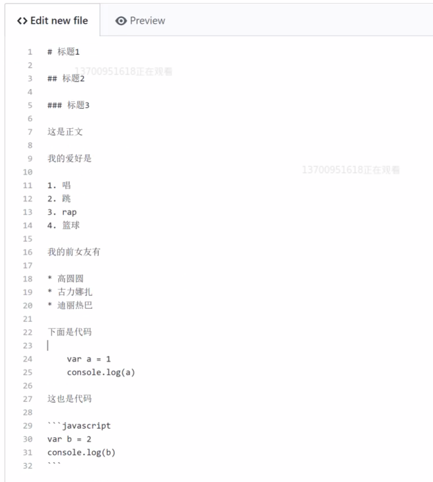

# 标题1
## 标题2
### 标题3

这是正文

我的爱好是

1. 唱
2. 跳
3. rap
4. 篮球

我的前女友是

* 迪丽热巴
* 古力娜扎
* 高圆圆

这是我的代码

    var a = 1
    console.log=(a)

下面也是代码

```javascript
var b=2
console.log=(b)
```

下面还是代码

~~~html
<head>你好</head>
~~~
这是我的博客

[这是我的博客](https://baidu.com)

